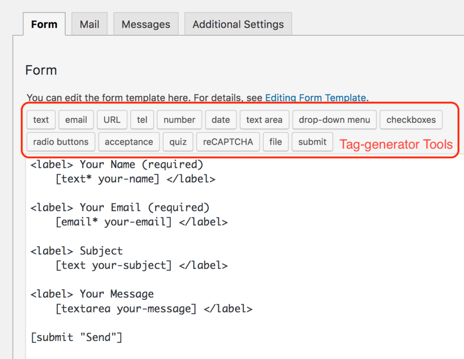

## 编辑表单模板

你可以在表单选项卡面板中编辑联系人表单的表单模板。HTML和Contact Form 7的表单标签可以在表单模板中使用。

表单标记用作HTML表单控件的占位符(例如文本输入字段)或一组表单控件(例如一组复选框)。表单标记在呈现表单时用HTML替换。

表单标记必须遵循特定的语法规则。否则，表单标签将无法正常工作。不过，不需要记住语法，因为你可以使用标记生成器工具来生成正确的表单标记。

注意，表单模板的更改不会自动反映在联系人表单的邮件设置中。因此，如果你向表单模板添加了表单标签，你需要在邮件标签面板中的邮件设置中手动添加相应的mail-tag。