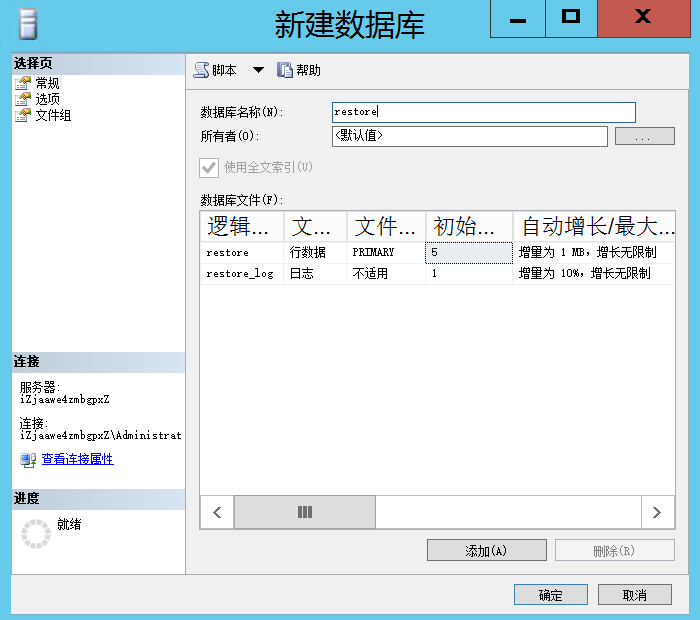
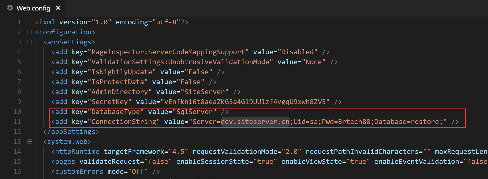
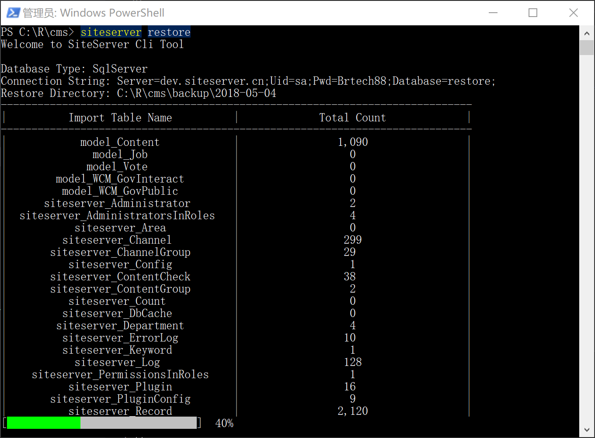
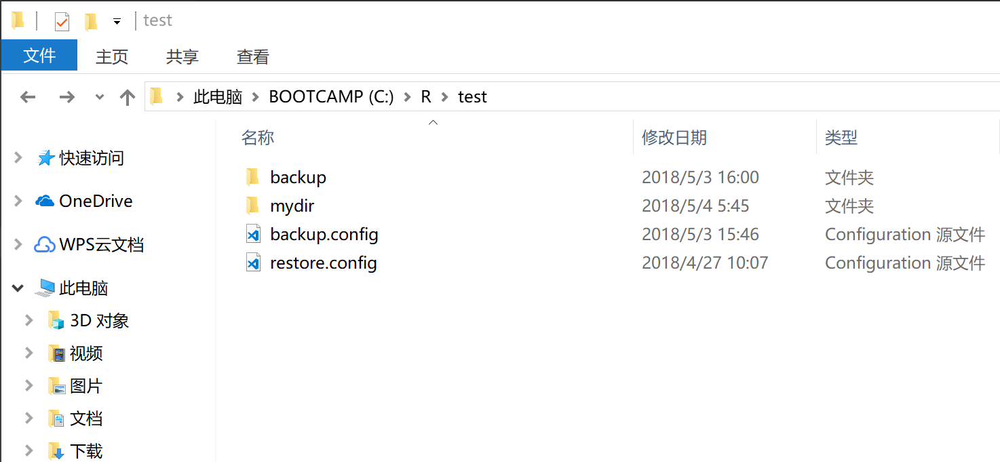

## 恢复命令

恢复命令为： `siteserver restore`，可以设置参数控制恢复选项。

### 1、开始使用

恢复命令默认读取当前目录下的 Web.config 文件，从中获取数据库连接字符串，进而获取当前目录下的**backup/<今天日期>**命名的文件夹，将文件夹内的备份数据恢复到数据库中。

需要注意的是，SiteServer 恢复命令目前还不支持增量恢复，只能将备份的数据一次性恢复到指定数据库中，故建议恢复命令使用新建的空数据库。

恢复命令支持 SiteServer CMS 支持的所有数据库，包括 SQLSERVER、MySQl、PostgreSQL以及Oracle。

例如我们希望恢复上文中备份的数据，首先需要新建恢复数据库：

然后找到系统所在文件夹路径：

修改 Web.config，将数据库连接字符串改为新建数据库的连接：

将命令行切换到此文件夹，并运行恢复命令：

`
siteserver restore
`

可以看到命令开始执行，界面将显示恢复进度：

恢复命令将逐一遍历备份文件夹中的文件，将文件内容完整导入至恢复数据库中，结束后，打开数据库，将看到数据库中增加了 SiteServer CMS 的表以及数据，数据恢复成功。

### 2、指定Web.config文件

如果需要恢复的数据库信息存储在其他文件中，可以通过`-c`或`--config=`加文件名的方式指定config文件。

下图显示的文件夹中有两个config文件，backup.config以及restore.config，分别存储了希望备份数据的数据库连接字符串以及希望恢复数据的数据库连接字符串：

打开restore.config，可以看到里面存在连接 SiteServer CMS 所用到的数据库类型 DatabaseType 以及连接字符串 ConnectionString。

将命令行切换到此文件夹，运行：

`
siteserver restore -c backup.config
`

命令结束后打开数据库，可以看到数据恢复成功。

### 3、指定备份存储文件夹

如果备份文件存储在其他文件夹中，可以通过`-d`或`--directory=`加文件夹名称的方式指定备份存储文件夹。

`
siteserver restore -c restore.config -d mydir
`

此命令将从mydir文件夹中获取备份数据并恢复到restore.config文件存储的数据库中。