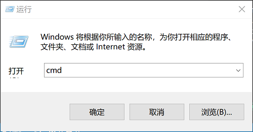
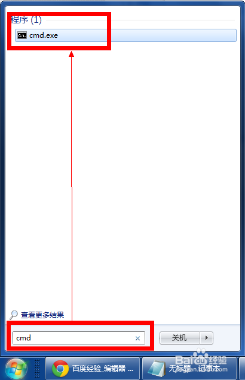
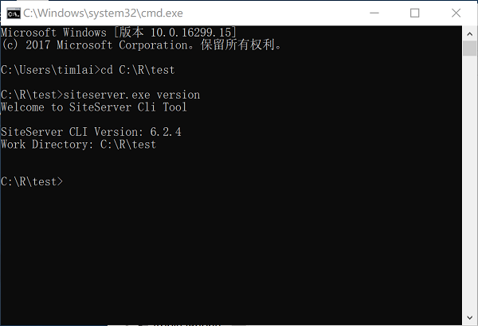
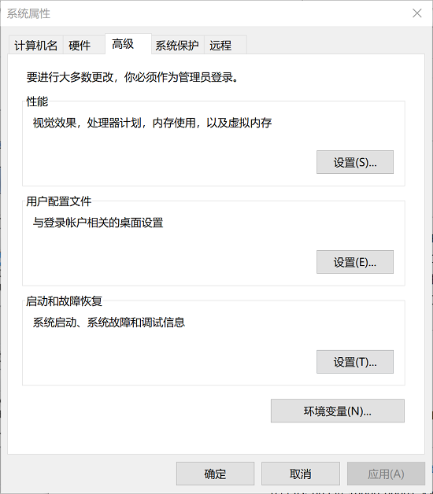
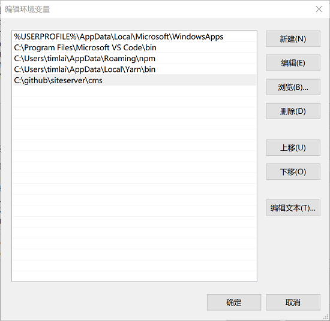
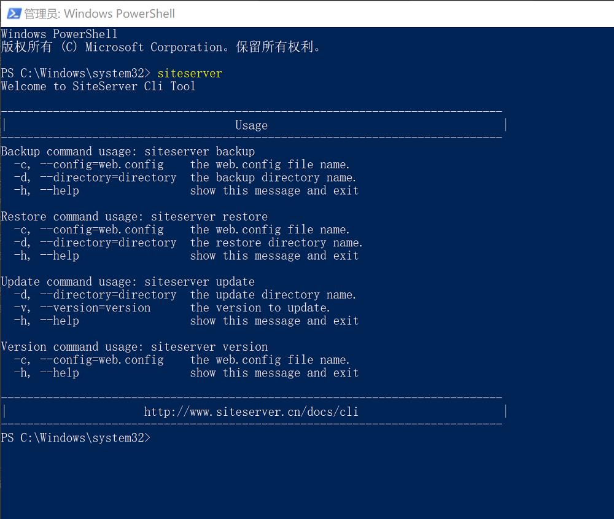

## 安装与设置

安装 SiteServer 命令行工具并准备就绪只需要几分钟时间。

### 1、下载 SiteServer Cli 命令行

进入 SiteServer CMS [产品下载页面](http://cms.siteserver.cn/download.html)，找到SiteServer Cli 命令行，点击下载按钮。

下载后的文件为一个名为 siteserver.exe 的可执行文件。

### 2、运行 SiteServer Cli 命令行

siteserver.exe 需要通过命令行执行，可以使用CMD或者Windows PowerShell，下面介绍如何打开CMD命令行。

进入Windows 运行弹出框输入cmd命令：

或者通过开始菜单找到cmd.exe：

进入命令行界面后进入 siteserver.exe 文件所在的文件夹，然后输入 `siteserver.exe version` 命令，界面将显示版本信息：

现在你可以开始通过 SiteServer Cli 命令行实现备份、恢复、升级等功能了。

### 3、设置环境变量

如果希望在任何文件夹中运行 siteserver.exe，可以通过设置Windows环境变量来实现，这也是我们推荐的用法，能够随时随地运行 SiteServer 命令。

首先右键我的电脑，在弹出菜单中选择属性，弹出系统界面，在系统界面中点击高级系统设置，弹出高级选项卡：

点击环境变量按钮，在弹出的对话框中编辑Path变量，添加 siteserver.exe 文件所在的文件夹地址：

重启机器后便能够在任意文件夹运行 siteserver 命令了，下图显示使用 Windows PowerShell打开 SiteServer Cli：

