## 升级命令

升级命令的作用是将 SiteServer CMS 6.0版本之前的系统升级到最新版本。

SiteServer CMS 6.0 之后的版本均支持在线升级，所以无需使用升级命令。

升级命令当前支持的版本包括：

- `SiteServer CMS 3.6` 版本（3.6、3.6.1、3.6.2、3.6.3、3.6.4）升级至最新版本
- `SiteServer CMS 4.0` 版本升级至最新版本
- `SiteServer CMS 4.1` 版本升级至最新版本
- `SiteServer CMS 5.0` 版本升级至最新版本

所有版本的升级方式基本一致，下面我们以`SiteServer CMS 4.1` 版本为例说明升级命令的使用方式。

### 第一步：备份数据

使用升级命令前需要先使用备份命令将老版本的数据库备份至文件夹中，找到 SiteServer CMS 系统所在文件夹：

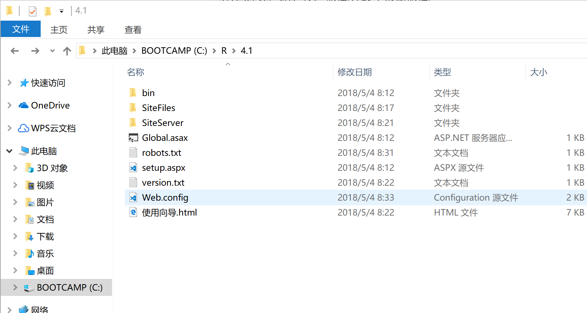

打开Web.config，可以看到当前系统使用的数据库信息：

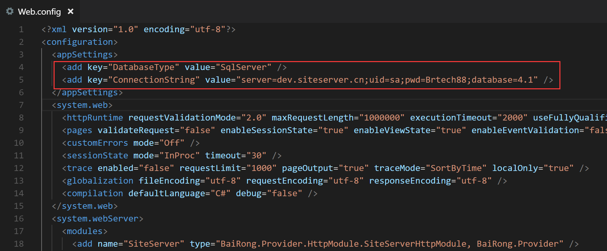

将命令行切换到此文件夹，并运行备份命令：

`
siteserver backup
`

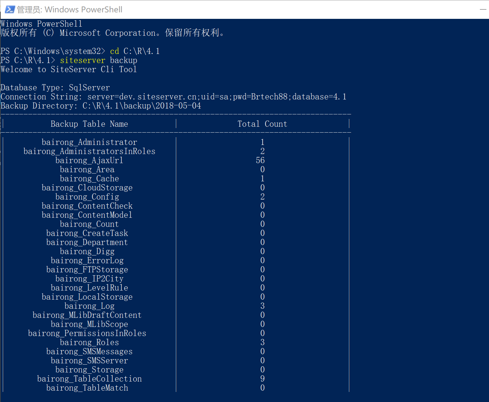

备份完成后文件夹中将多出backup文件夹：

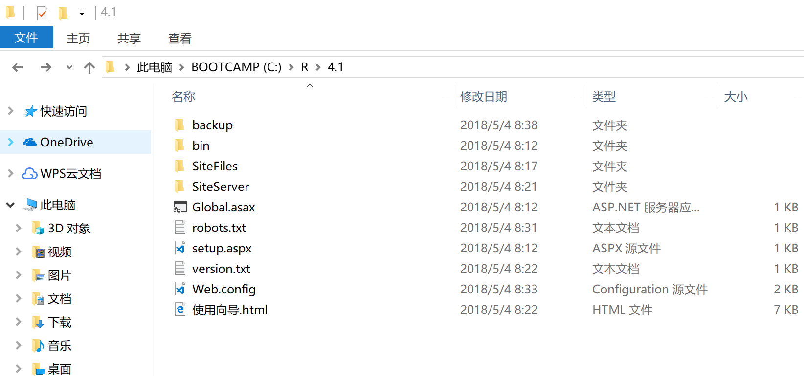

### 第二步：升级

备份完成后便可以使用升级命令了，升级命令将把备份文件中存储的数据结构改为最新版本的数据结构，升级完成后将生成新的文件夹，用于恢复命令使用。

将命令行切换到系统根目录，运行升级命令：

`
siteserver update -v 4.1
`

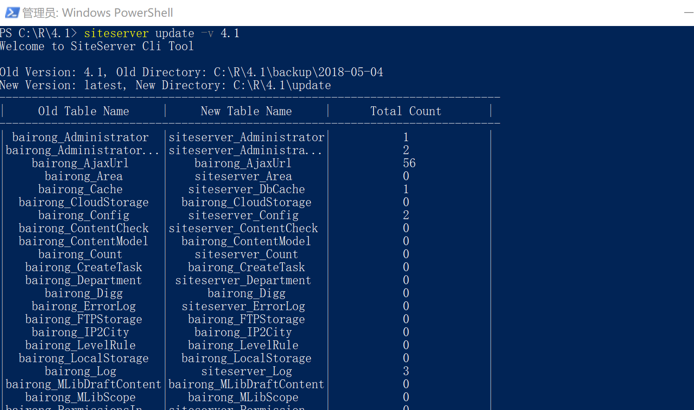

注意，升级命令必须加参数`-v` 或者 `--version=` 并指定具体的版本信息，目前支持的参数有：

- `3.6`
- `4.0`
- `4.1`
- `5.0`

如果备份文件夹没有存储在**backup/<今天日期>**文件夹中，可以通过`-d`或`--directory=`加文件夹名称的方式指定备份存储文件夹。

`
siteserver update -v 4.1 -d mybackup
`

升级命令执行完毕后，系统根目录将出现一个名为update的文件夹，此文件夹中存储了升级之后的数据文件：

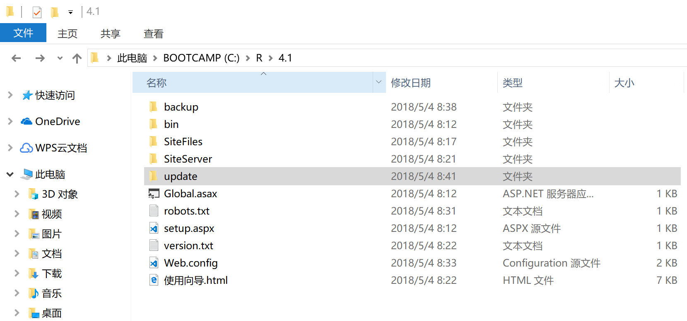

### 第三步：搭建新版本环境

新建一个空的数据库，升级后的新版本系统的数据将保存在此数据库中，在此，我们新建了一个名为`cms_new`的数据库：

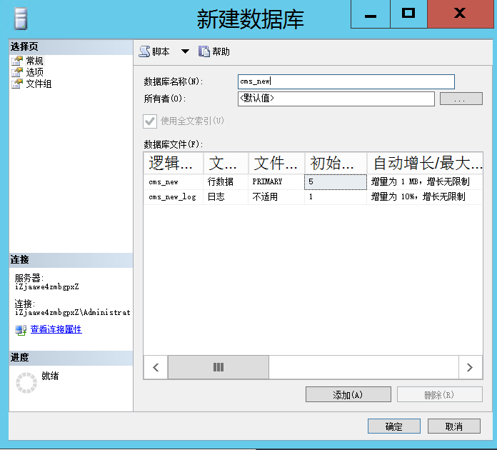

接下来，我们下载最新版本的 SiteServer CMS 系统，在此，我们将新系统存放到`cms_new`文件夹中：

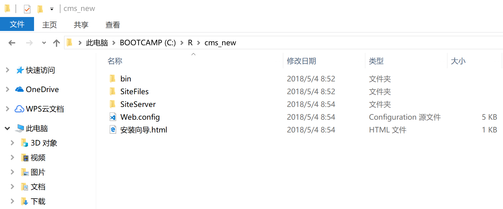

接下来，我们修改新版本的Web.config文件，将新建的数据库信息放到此文件中：

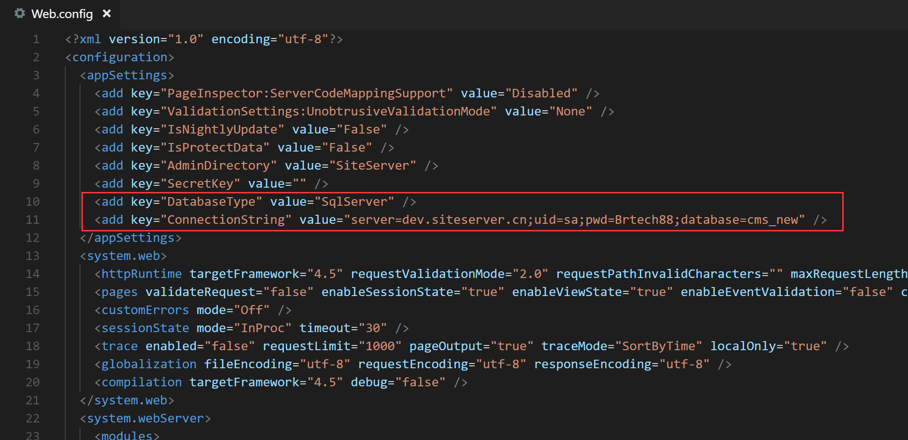

最后，我们新建IIS站点，指向此文件夹：

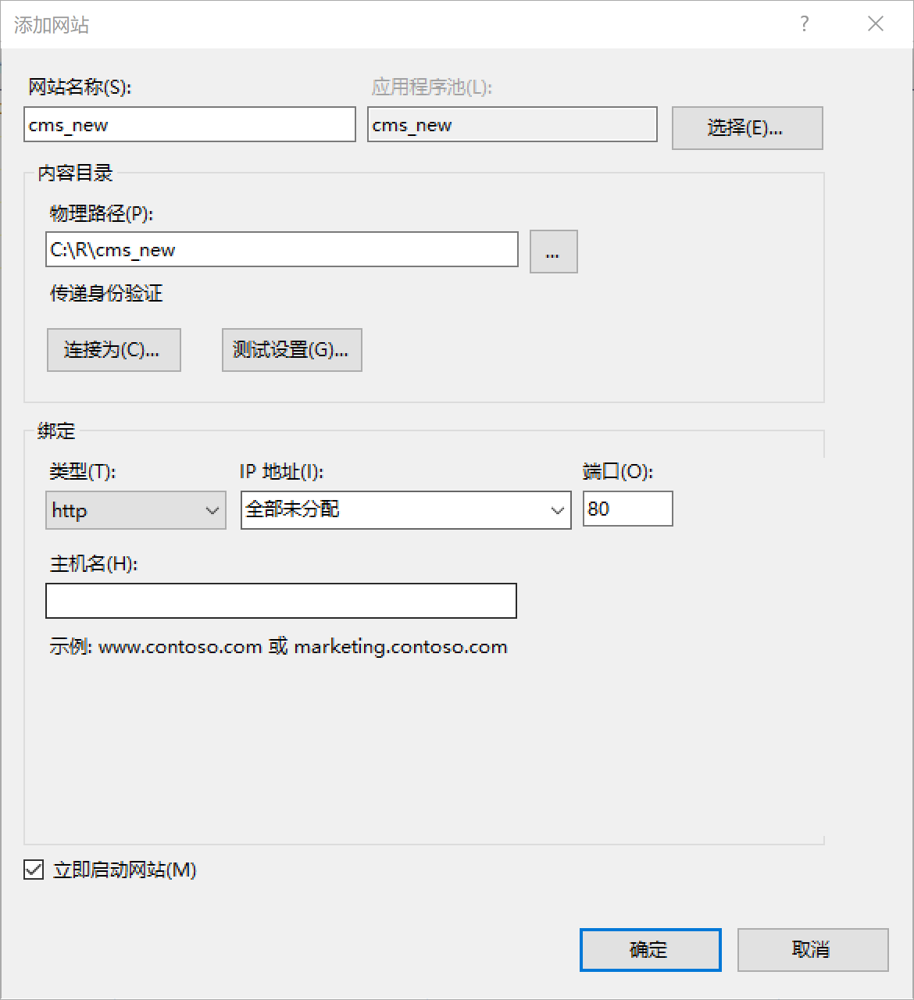

完成以上步骤后，新版本系统的环境便全部搭建完成。

### 第四步：恢复数据

将update文件夹从老版本系统根目录复制到新版本系统的根目录：

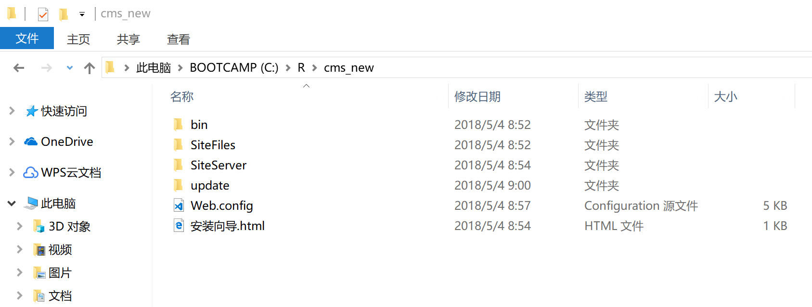

将命令行切换到新版本系统的根目录，运行恢复命令（注意，恢复命令需要指定-d 参数，从 update 文件夹中恢复）：

`
siteserver restore -d update
`

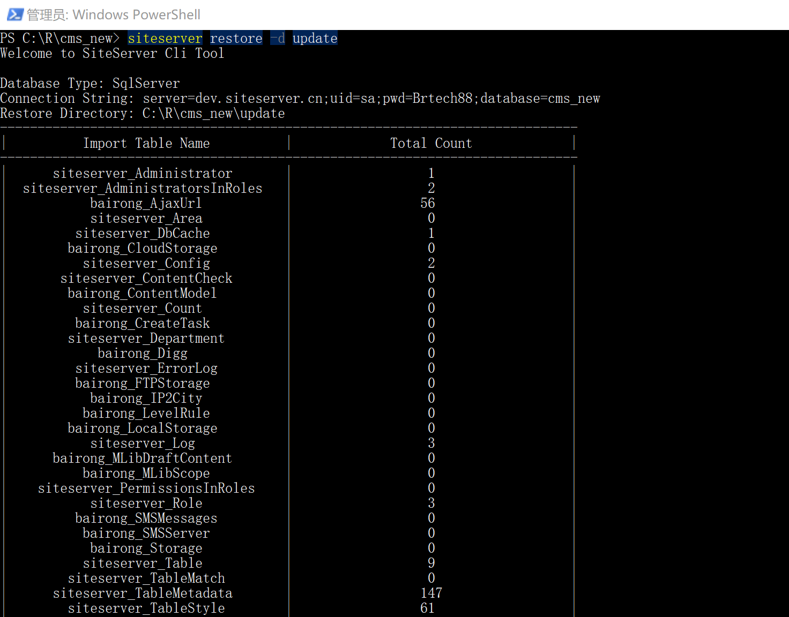

数据恢复后，便可以打开浏览器访问新系统后台了：

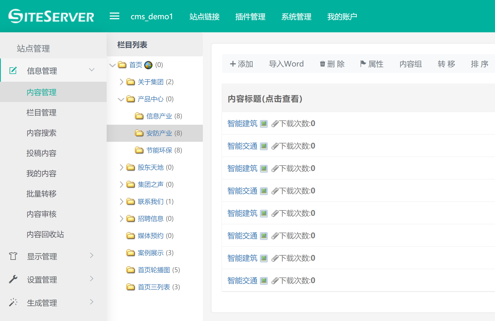

可以看到，老版本的数据已经转移到了新版本。

最后，将老版本系统文件夹中的站点文件复制到新版本系统文件夹中，切换域名，完成版本升级。